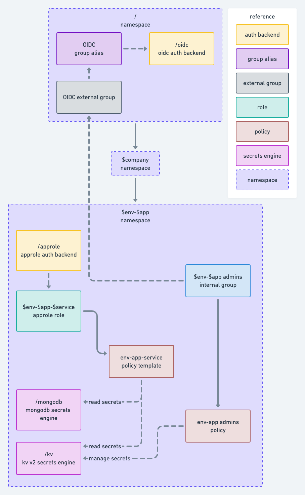

# Terraform Vault configuration

This repository contains example code to get you started configuring Vault Enterprise using Terraform

There are several directories containing Terraform modules and configurations that consume those modules:

- `configurations` - exampleterraform configurations
  - `vault-admin` - Basic Vault bootstrap. Configures
    - Enables audit logs using syslog and a file (configurable path) for redundancy
    - OIDC Auth backend (Azure AD)
    - Vault admin policy
    - Internal Vault admin group that uses the policy above
    - External OIDC group that is a member of the internal Vault admin group
    - Top level namespace
  - `vault-namespace` - Application stack namespace with MongoDB Atlas dynamic credentials. Configures
    - Namespace under the top level one for env/app
    - Vault policy to allow creation of dynamic credentials
    - Internal Vault user group that uses the policy above
    - External OIDC group that is a member of the internal user group
    - MongoDB Atlas connection
    - MongoDB role that creates dynamic credentials using a configurable creation statement
- `modules`
  - `terraform-vault-auth-oidc`
    - configures an OIDC auth backend
  - `terraform-vault-auth-oidc-group`
    - configures and external OIDC group and entity alias
  - `terraform-vault-internal-group`
    - configures an internal identity group and ACL policy linked to it
  - `terraform-vault-namespace`
    - configures an the namespace as indicated above
  - `terraform-vault-secrets-mongodb-atlas-mount`
    - configures a MongoDB Atlas secrets engine mount
  - `terraform-vault-secrets-mongodb-atlas-role`
    - configures a MongoDB Atlas secrets engine role associated with a mount

## Vault namepaces diagram

`vault-admin` configures the root and `$company` namespaces. `vault-namespace` conmfigures `$env-$app` namespace 

> **NOTE:** The AppRole auth method, KV secrets engine, and associated policies are not implemented).

> **NOTE:** `$env`,  `$app`, and  `$service` represent Terraform variables (e.g., `var.env`) shortened to make the diagram more compact and easier to read.
